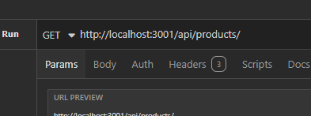

# Ecommerce site backend
[](https://opensource.org/licenses/MIT)
  
## Description

This challenge of this project was to refactor starter code to program backend routes for products on an ecommerce website. I learned a lot about PUT routes especially in this project, having to make a many to many table relationship and coding those routes to function was difficult to figure out.

## Installation

To start the application you will need to install the dependencies by running
```npm i```
Then run the seed data by running the command
```npm run seed```
And finally run the command
```npm run watch```
To initalize nodemon.

The server should then be running on PORT 3001, and you will be able to make changes to it and it will automatically update as long as nodemon is running.



You will be able to access the server by typiing this route into insomnia `http://localhost:3001/api/`

## Usage

The best use of these routes is if you are having to store large amounts of data, you can easily access it and create new products, tags, and categories, as well as edit and delete them.

## Contributing

This project was coded using the starter code provided by github user Xandromus from github repository bookish-sniffle.

## License

MIT License Copyright (c) 2024 <author>

Permission is hereby granted, free of charge, to any person obtaining a copy of this software and associated documentation files (the "Software"), to deal in the Software without restriction, including without limitation the rights to use, copy, modify, merge, publish, distribute, sublicense, and/or sell copies of the Software, and to permit persons to whom the Software is furnished to do so, subject to the following conditions:

The above copyright notice and this permission notice (including the next paragraph) shall be included in all copies or substantial portions of the Software.

THE SOFTWARE IS PROVIDED "AS IS", WITHOUT WARRANTY OF ANY KIND, EXPRESS OR IMPLIED, INCLUDING BUT NOT LIMITED TO THE WARRANTIES OF MERCHANTABILITY, FITNESS FOR A PARTICULAR PURPOSE AND NONINFRINGEMENT. IN NO EVENT SHALL THE AUTHORS OR COPYRIGHT HOLDERS BE LIABLE FOR ANY CLAIM, DAMAGES OR OTHER LIABILITY, WHETHER IN AN ACTION OF CONTRACT, TORT OR OTHERWISE, ARISING FROM, OUT OF OR IN CONNECTION WITH THE SOFTWARE OR THE USE OR OTHER DEALINGS IN THE SOFTWARE.

## Questions

Questions about the prooject should be directed through the following contacts below.
Link to github profile: [mcellis1](https://github.com/mcellis1)
Email: [matthewcellis98@gmail.com](mailto:matthewcellis98@gmail.com)
